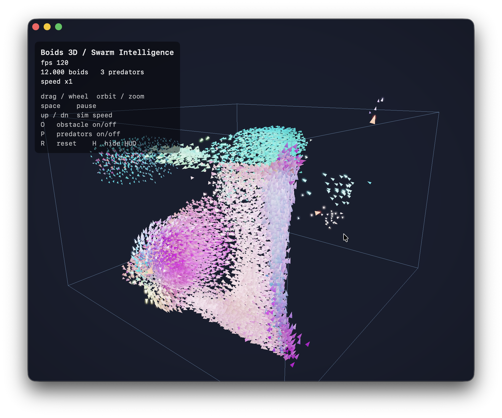

# Boids 3D / Swarm Intelligence — Swift + Metal

GPU-accelerated 3D flocking, ported from the C++/OpenGL version. The entire
simulation runs on the GPU as a Metal compute kernel; rendering is HDR with a
bright-pass + separable Gaussian **bloom** and an **ACES** tone-map.

## Build (Xcode)

1. New project → **macOS → App**, Interface **SwiftUI**, Language **Swift**.
2. Delete the generated `ContentView.swift` / `…App.swift`.
3. Drag all files from `BoidsMetal/` into the target:
   `App.swift`, `Renderer.swift`, `Camera.swift`, `Types.swift`,
   `SimState.swift`, `MetalView.swift`, `Shaders.metal`.
4. Build & run. Requires macOS 12+ (Apple Silicon or any Metal-capable Mac).

`Shaders.metal` is compiled automatically into the app's `default.metallib`,
which `device.makeDefaultLibrary()` loads at startup.

## Controls

| input | action |
|---|---|
| left-drag | orbit camera |
| scroll | zoom |
| space | pause |
| up / down | sim speed (substeps per frame) |
| O | obstacle on/off |
| P | predators on/off |
| R | reset |
| H | hide HUD |

## Architecture

**Simulation — `boids_update` (compute).** N-body-style brute force with
threadgroup tiling: each thread cooperatively loads a 256-boid tile into
threadgroup memory, syncs, then reads neighbours from fast on-chip memory.
For 12k boids this beats a CPU hash grid on Apple Silicon and stays
dependency-free. Positions/velocities ping-pong between two buffer sets; a
`memoryBarrier(scope:.buffers)` separates substeps. Predators run in a tiny
second kernel (`predators_update`) that brute-scans for the nearest boid.

**Render.** Instanced camera-facing arrowheads (3 verts/instance) built in the
vertex shader from each boid's position + velocity, written into an
`rgba16Float` HDR target. Fast boids get an emissive boost (>1.0) so the bloom
catches them; predators are HDR red.

**Post.** bright-pass → half-res → horizontal blur → vertical blur →
composite (additive bloom + ACES + vignette + gamma) to the drawable.

## Tuning

All flocking parameters live in `SimParams` (`Types.swift`): perception radius,
separation distance, the five steering weights, speed/force limits, predators,
obstacle. The Metal struct mirrors it field-for-field (all 4-byte scalars, so
no alignment guesswork).

Want more boids? Bump `count` in `SimParams`. Brute force is O(N²); ~30–40k is
still smooth on M-series. Beyond that, swap the kernel for a GPU spatial hash
(counting-sort build) — same render path.

> Note: written without a Metal toolchain on hand, so a small Xcode fixup or
> two may be needed.
