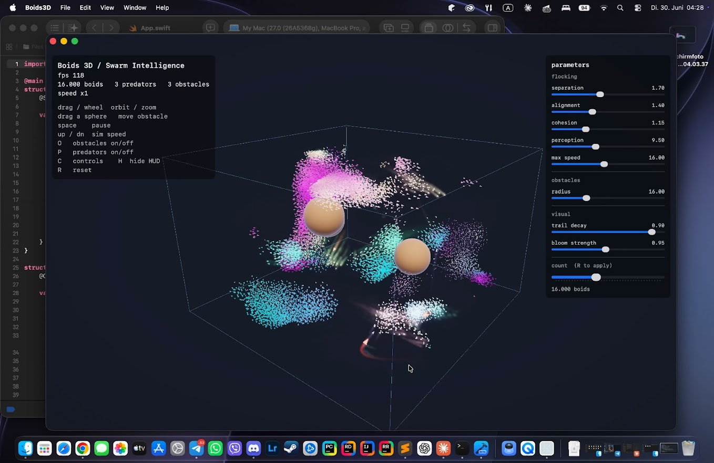

# Boids 3D / Swarm Intelligence — Swift + Metal

GPU-accelerated 3D flocking, ported from the C++/OpenGL version. The entire
simulation runs on the GPU as a Metal compute kernel; rendering is HDR with a
bright-pass, a temporal **motion-trail** feedback, a separable Gaussian
**bloom** and an **ACES** tone-map. Obstacles are real **opaque, lit spheres**
you can **drag around the tank with the mouse in real time**, and the core
flocking/visual parameters are exposed as **live SwiftUI sliders**.

## Build

### Xcode
1. New project → **macOS → App**, Interface **SwiftUI**, Language **Swift**.
2. Delete the generated `ContentView.swift` / `…App.swift`.
3. Drag all source files into the target: `App.swift`, `Renderer.swift`,
   `Camera.swift`, `Types.swift`, `SimState.swift`, `MetalView.swift`,
   `Shaders.metal`.
4. Build & run. Requires macOS 12+ (Apple Silicon or any Metal-capable Mac).

### Command line
`./build.sh run` — compiles the shaders and Swift sources into `Boids3D.app`
and launches it. No Xcode project required (just the Command Line Tools).

`Shaders.metal` is compiled into the app's `default.metallib`, which
`device.makeDefaultLibrary()` loads at startup.

## Controls

| input | action |
|---|---|
| left-drag (empty space) | orbit camera |
| left-drag (on a sphere) | **move that obstacle** |
| scroll | zoom |
| space | pause |
| up / down | sim speed (substeps per frame) |
| O | obstacles on/off |
| P | predators on/off |
| C | show/hide the parameter panel |
| H | hide HUD |
| R | reset (also applies a new boid count) |

The panel on the right has live sliders for the steering weights, perception
radius, max speed, obstacle radius, trail length and bloom strength. The boid
**count** slider applies on the next **R** (the GPU buffers are sized once at
40k capacity).

## Architecture

**Simulation — `boids_update` (compute).** N-body-style brute force with
threadgroup tiling: each thread cooperatively loads a 256-boid tile into
threadgroup memory, syncs, then reads neighbours from fast on-chip memory.
For ~16k boids this beats a CPU hash grid on Apple Silicon and stays
dependency-free. Positions/velocities ping-pong between two buffer sets; a
`memoryBarrier(scope:.buffers)` separates substeps. Predators run in a tiny
second kernel (`predators_update`) that brute-scans for the nearest boid.
Integration is symplectic (semi-implicit) Euler.

**Obstacles.** A small `float4` buffer (xyz = centre, w = radius) feeds both
the simulation and the renderer. Boids get a soft avoidance steering force
*and* a hard, non-penetrating constraint — if a boid would end the step inside
a sphere it is snapped to the surface and its inward velocity removed, so the
opaque geometry is never seen with boids inside it. Picking is a CPU ray–sphere
test (unproject the cursor through the inverse view-projection); dragging moves
the sphere in the camera-facing plane through its centre, clamped to the tank.

**Render.** Instanced camera-facing arrowheads (3 verts/instance) built in the
vertex shader from each boid's position + velocity, into an `rgba16Float` HDR
target. Fast boids get an emissive boost (>1.0) so the bloom catches them;
predators are HDR red. Obstacle spheres are an indexed instanced mesh, matte-lit
with a cool fresnel rim, kept below 1.0 so they read as solids and don't bloom.

**Post.** bright-pass → **trail accumulate** (`prev × decay + bright`,
ping-ponged) → horizontal blur → vertical blur → composite (additive
bloom + ACES + vignette + gamma). Only the bright pass feeds the trail, so the
dim box and the opaque spheres never smear — only fast/glowing boids leave
streaks.

## Tuning

All flocking parameters live in `SimParams` (`Types.swift`) and most are now
slider-driven via `SimState`. The Metal struct mirrors `SimParams`
field-for-field (all 4-byte scalars, so no alignment guesswork).

Brute force is O(N²); ~30–40k is still smooth on M-series. Beyond that, swap the
kernel for a GPU spatial hash (counting-sort build) — same render path.

> Note: written without a Metal toolchain on hand, so a small Xcode fixup or
> two may be needed.
